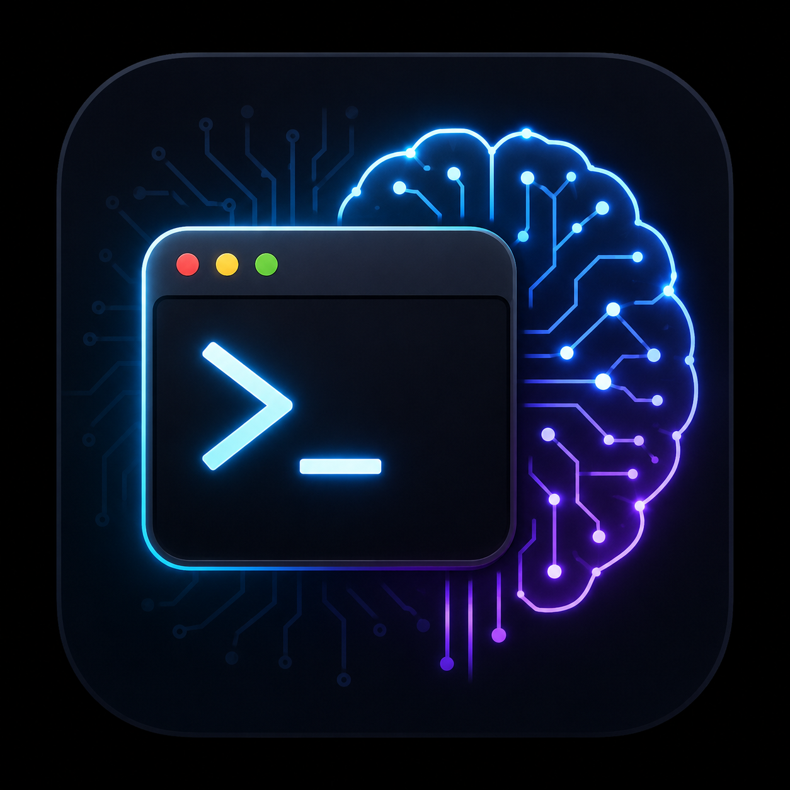

<div align="center">



# Pannel Handle

**Windows Desktop Terminal Session Manager**

[](https://www.electronjs.org/)
[](https://react.dev/)
[](https://www.typescriptlang.org/)
[](https://vitejs.dev/)
[](https://xtermjs.org/)
[](./LICENSE)

[:cn: 简体中文](./README.zh-CN.md)

</div>

---

## What is Pannel Handle?

**Pannel Handle** is a Windows desktop application for managing all your terminal sessions in one place. It combines a multi-tab terminal emulator with deep **AI agent status monitoring** (Claude Code / Codex / OpenCode). Manage local shells, SSH remote sessions, and track your AI assistant's real-time status — all in a single unified interface.


---

## Core Features

### Multi-Session Terminal Management

- **Local Shells** — Launch PowerShell, CMD, or any WSL distribution with one click
- **SSH Remote** — Password and key-based authentication with built-in known-hosts management
- **Session Library** — Save frequently used sessions with tags, drag-and-drop reorder, batch import/export
- **Quick Commands** — Bind common shell commands to each session, one click to send
- **Session Clone** — Duplicate an existing session config instantly

### AI Agent Status Monitoring

Real-time agent status captured via Claude Code / Codex / OpenCode hooks and displayed in the UI:

| Status | Meaning |
|--------|---------|
| 🟢 Running | Agent is processing a request or executing tools |
| 🟡 Waiting for Permission | Agent requests approval for an action |
| 🔵 Waiting for Input | Agent is idle, waiting for the next prompt |
| ✅ Completed | Task finished successfully |
| ❌ Failed | Tool execution error |
| ⚫ Ended | Session terminated |

- **Desktop Notifications** — Popup alerts on agent status changes
- **DingTalk Notifications** — Webhook push notifications, stay informed even away from the desk
- **One-Click Hook Install** — Auto-configure hook scripts for Claude/Codex/OpenCode within a session

### Remote File Manager

- **SFTP File Panel** — Graphical remote filesystem browser: create, edit, delete, upload, download
- **In-App Image Preview** — View remote images directly within the app
- **ripgrep-Powered Search** — Search file names and text content across remote directories in seconds

### Git Status Panel

- Real-time repository status: branch, unstaged changes, untracked files
- Diff preview and stash management
- Works with both local and SSH remote repositories

### AI Completion Quality Tracking

- Collect and visualize quality metrics for in-terminal AI completions
- Debug mode provides per-completion detailed logs and latency analysis

### Themes & i18n

- **4 Terminal Themes** — Dark Slate, Dark Blue, Dark Green, Light
- **Bilingual UI** — Simplified Chinese and English

---

## Getting Started

### Prerequisites

- Windows 10/11
- Node.js 18+
- pnpm

### Install & Run

```bash
git clone <repo-url>
cd pannel_handle
pnpm install
pnpm start        # Launch in development mode

# Or start separately
pnpm dev          # Vite dev server at 127.0.0.1:5173
pnpm electron     # Launch Electron
```

### Build

```bash
pnpm build         # Type-check + production build
pnpm dist:portable # Package as Windows portable
```

---

## Project Structure

```
pannel_handle/
├── src/                      # Renderer process (React + TypeScript)
│   ├── App.tsx               # Main layout & page state
│   ├── components/
│   │   ├── app/              # Title bar
│   │   ├── sessions/         # Session sidebar, create/edit/picker modals
│   │   ├── terminal/         # Terminal panel, quick commands, completion debug
│   │   ├── remote/           # Remote file panel, system status, project search
│   │   ├── agents/           # Agent debug sidebar, hook installer
│   │   ├── git/              # Git status panel
│   │   ├── settings/         # Settings modal
│   │   └── shared/           # Shared UI components
│   ├── hooks/                # Custom React hooks
│   ├── styles/               # Layered CSS styles
│   ├── i18n.ts               # Internationalization
│   └── themes.ts             # Terminal color theme definitions
├── electron/                 # Electron main process (CommonJS)
│   ├── main.cjs              # App entry, module wiring
│   ├── preload.cjs           # Secure API bridge
│   ├── core/                 # Window manager, IPC handlers
│   ├── terminal/             # PTY terminal manager
│   ├── ssh/                  # SSH connection, SFTP, hook tunnel
│   ├── hooks/                # Agent hook server, config manager
│   ├── services/             # Remote file, git, search, completion
│   ├── agents/               # Listener agent
│   ├── notifications/        # System & DingTalk notifications
│   └── stores/               # Persistent config & session data
├── docs/                     # Hook configuration guides
├── scripts/                  # Build helper scripts
└── build/                    # App icon & packaging assets
```

---

## Tech Stack

| Layer | Stack |
|-------|-------|
| Desktop Framework | Electron 35 |
| Frontend | React 19 + TypeScript 5 + Vite 6 |
| Terminal | xterm.js 5 + node-pty |
| SSH | ssh2 + ssh2-sftp-client |
| Search | @vscode/ripgrep |
| Syntax Highlighting | highlight.js |
| Packaging | electron-builder (portable) |

---

## Security

- `contextIsolation: true`, `nodeIntegration: false` — renderer runs in a sandbox
- All renderer-to-main communication goes through `preload.cjs` controlled APIs
- Credentials and known-hosts data stored in Electron `userData` directory, never committed
- SSH keys encrypted via `safeStorage`

---

## Development

```bash
pnpm test   # Run tests
pnpm build  # Type-check
```

Before committing, ensure `pnpm build` passes. For changes touching Electron main process modules, also run `pnpm test` and optionally verify `.cjs` syntax with `node --check`.

---

## License

MIT

---

<div align="center">

**Pannel Handle** — Your terminal, your remote servers, and your AI agents, all working together in one place.

</div>
