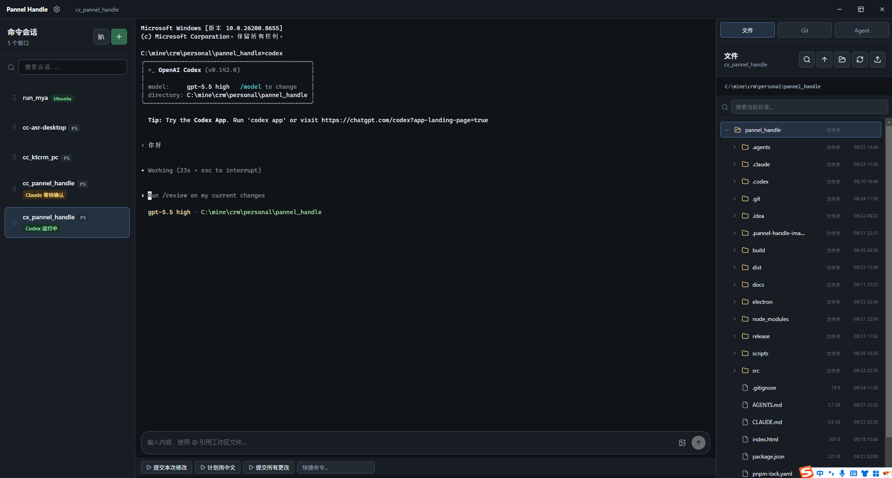

<div align="center">


# Pannel Handle

**Windows 桌面终端会话管理器**

[](https://www.electronjs.org/)
[](https://react.dev/)
[](https://www.typescriptlang.org/)
[](https://vitejs.dev/)
[](https://xtermjs.org/)
[](./LICENSE)

[:us: English](./README.en.md)

</div>

---

## 这是什么？

**Pannel Handle** 是一款 Windows 桌面终端管理工具。它不仅提供多标签终端体验，还深度集成了 **AI Agent 状态监听**（Claude Code / Codex / OpenCode），让你在同一个界面中管理本地终端、SSH 远程会话，并实时追踪 AI 助手的工作状态。



---

## 核心功能

### 多会话终端管理

- **本地终端** — 一键启动 PowerShell、CMD 或 WSL 发行版
- **SSH 远程连接** — 支持密码和密钥认证，内置 known-hosts 管理
- **会话库** — 保存常用会话配置，支持标签分类、拖拽排序、批量导入/导出
- **快速命令** — 为每个会话绑定常用 shell 命令，点一下即输入
- **会话复制** — 快速克隆现有会话配置，省去重复填写

### AI Agent 状态追踪

通过 Claude Code / Codex / OpenCode 的 hooks 机制实时捕获 Agent 运行状态：

| 状态 | 含义 |
|------|------|
| 🟢 运行中 | Agent 正在处理请求或执行工具 |
| 🟡 等待确认 | Agent 请求权限，等待人工审批 |
| 🔵 等待输入 | Agent 空闲，等待下一轮对话 |
| ✅ 已完成 | 任务执行成功 |
| ❌ 失败 | 工具执行出错 |
| ⚫ 已结束 | 会话终止 |

- **系统通知** — Agent 状态变化时弹窗提醒，不用一直盯着屏幕
- **钉钉通知** — 支持 Webhook 推送，离开工位也不错过状态变更
- **一键安装 Hook** — 在会话中自动配置 Claude/Codex/OpenCode 的 hook 脚本

### 远程文件管理

- **SFTP 文件面板** — 图形化操作远程文件系统，支持新建、编辑、删除、上传、下载
- **图片预览** — 远程图片直接在应用内查看
- **ripgrep 搜索** — 基于 ripgrep 的文件名和文本内容搜索，秒级返回结果

### Git 状态面板

- 实时查看 Git 仓库状态（分支、未暂存变更、未提交文件）
- 支持 diff 预览和 stash 管理
- 本地和 SSH 远程仓库均可使用

### AI 补全质量追踪

- 终端内 AI 补全的质量指标采集与可视化
- Debug 模式下可查看每次补全的详细日志和耗时分析

### 主题与国际化

- **4 套终端主题** — Dark Slate、Dark Blue、Dark Green、Light
- **中英文切换** — 支持简体中文和 English 界面

---

## 快速开始

### 环境要求

- Windows 10/11
- Node.js 18+
- pnpm

### 安装与运行

```bash
git clone <repo-url>
cd pannel_handle
pnpm install
pnpm start        # 开发模式启动

# 或分别启动
pnpm dev          # Vite 开发服务器 (127.0.0.1:5173)
pnpm electron     # 启动 Electron
```

### 构建

```bash
pnpm build         # 类型检查 + 生产构建
pnpm dist:portable # 打包 Windows portable 安装包
```

---

## 项目结构

```
pannel_handle/
├── src/                      # 渲染进程 (React + TypeScript)
│   ├── App.tsx               # 主布局与页面状态管理
│   ├── components/
│   │   ├── app/              # 标题栏
│   │   ├── sessions/         # 会话侧栏、创建/编辑/选择弹窗
│   │   ├── terminal/         # 终端面板、快捷命令、补全调试
│   │   ├── remote/           # 远程文件面板、系统状态、项目搜索
│   │   ├── agents/           # Agent 状态调试、Hook 安装
│   │   ├── git/              # Git 状态面板
│   │   ├── settings/         # 设置弹窗
│   │   └── shared/           # 通用 UI 组件
│   ├── hooks/                # 终端实例、会话数据、窗口状态等 Hooks
│   ├── styles/               # 分层样式 (tokens/base/layout/components/features)
│   ├── i18n.ts               # 国际化
│   └── themes.ts             # 终端主题定义
├── electron/                 # Electron 主进程 (CommonJS)
│   ├── main.cjs              # 应用入口，模块装配
│   ├── preload.cjs           # 安全 API 桥接
│   ├── core/                 # 窗口管理、IPC 处理
│   ├── terminal/             # PTY 终端管理
│   ├── ssh/                  # SSH 连接、SFTP、Hook 隧道
│   ├── hooks/                # Agent Hook 服务、配置管理
│   ├── services/             # 远程文件、Git、搜索、补全服务
│   ├── agents/               # Listener Agent
│   ├── notifications/        # 系统通知、钉钉通知
│   └── stores/               # 配置、会话、补全数据持久化
├── docs/                     # Hook 配置文档
├── scripts/                  # 构建辅助脚本
└── build/                    # 图标等资源
```

---

## 技术栈

| 层 | 技术选型 |
|---|---------|
| 桌面框架 | Electron 35 |
| 前端 | React 19 + TypeScript 5 + Vite 6 |
| 终端 | xterm.js 5 + node-pty |
| SSH | ssh2 + ssh2-sftp-client |
| 搜索 | @vscode/ripgrep |
| 代码高亮 | highlight.js |
| 打包 | electron-builder (portable) |

---

## 安全策略

- `contextIsolation: true`，`nodeIntegration: false` — 渲染进程沙箱隔离
- 渲染进程通过 `preload.cjs` 受控 API 与主进程通信
- 凭据和已知主机信息存储在 Electron `userData` 目录，不入仓库
- SSH 密钥通过 `safeStorage` 加密存储

---

## 开发

```bash
pnpm test   # 运行测试
pnpm build  # 类型检查
```

提交前请确保 `pnpm build` 通过。涉及 Electron 主进程模块的改动需同时运行 `pnpm test`，必要时用 `node --check` 检查 `.cjs` 文件语法。

---

## 许可

MIT

---

<div align="center">

**Pannel Handle** — 让你的终端、远程服务器和 AI Agent 在一处协同工作。

</div>
